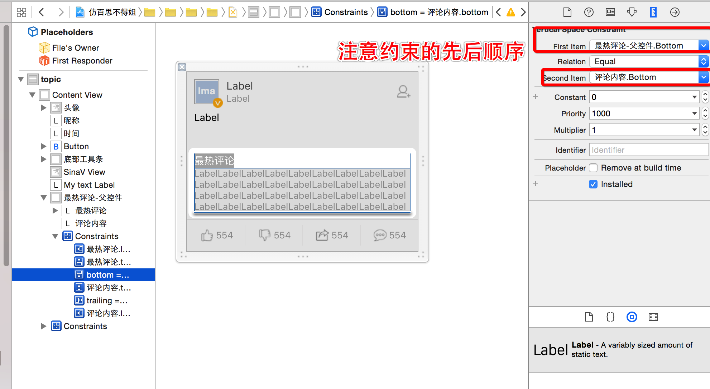
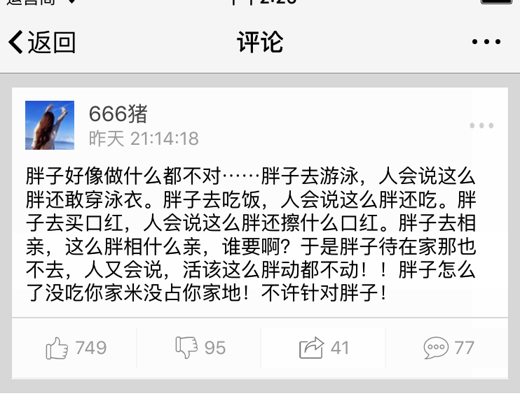
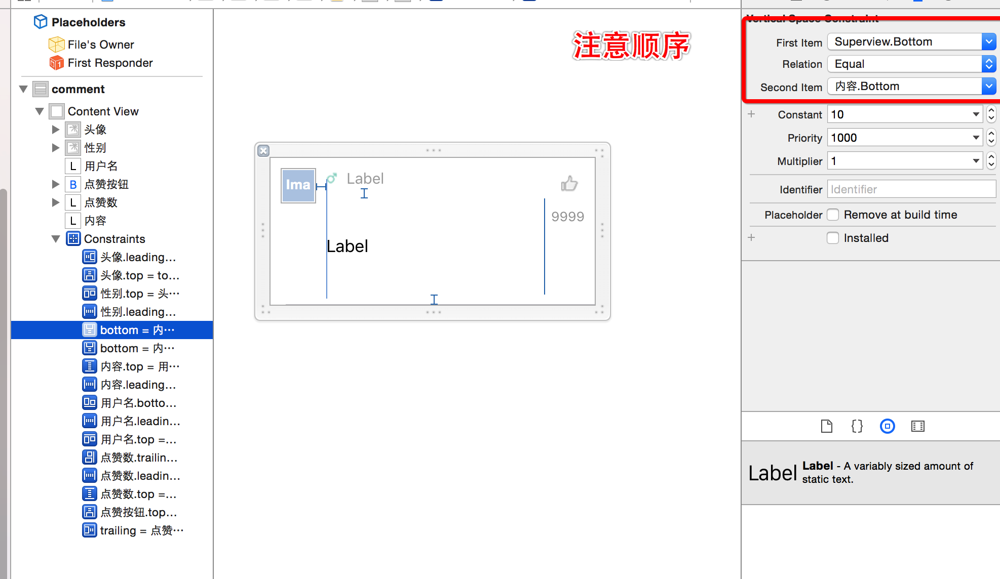
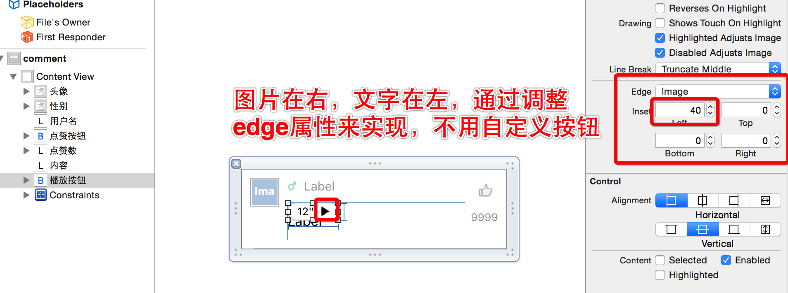
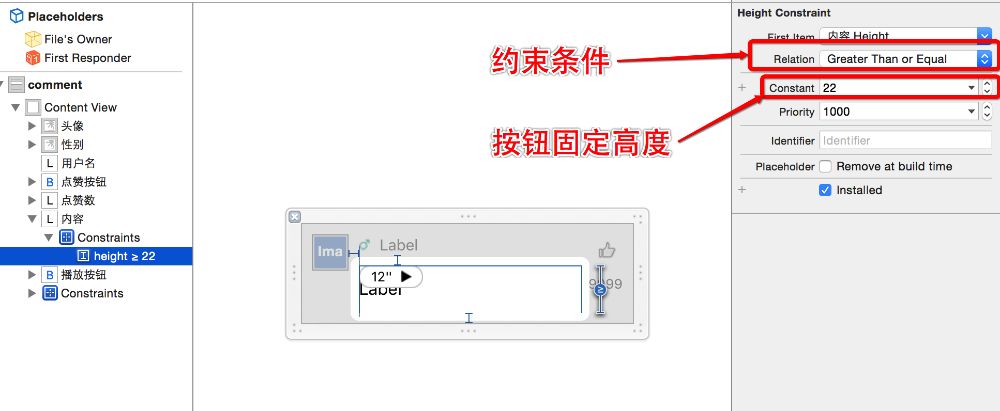
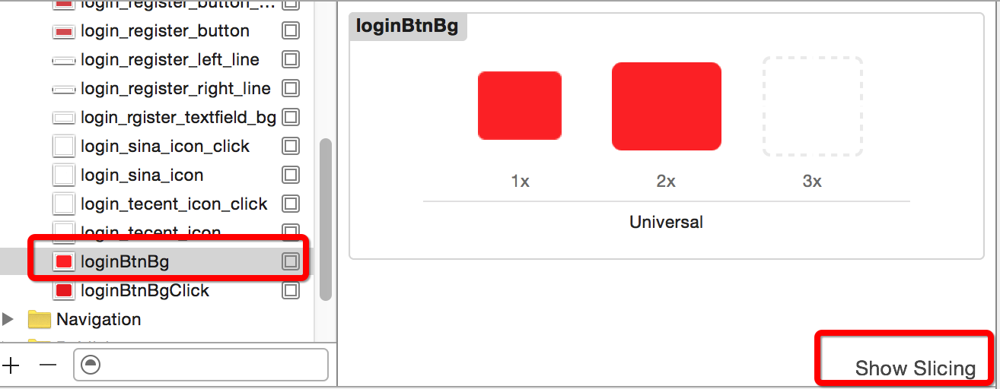
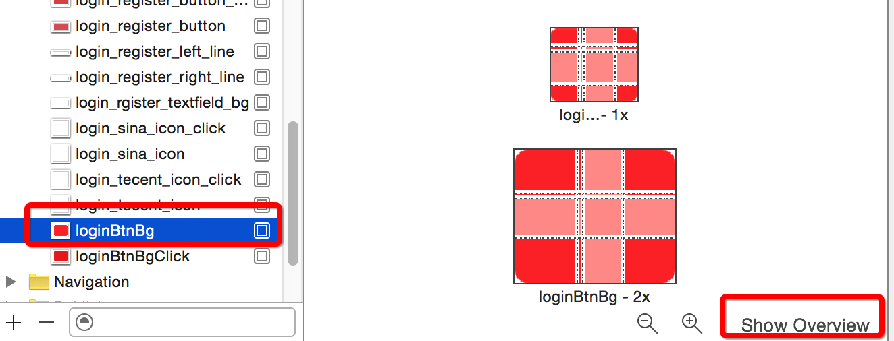
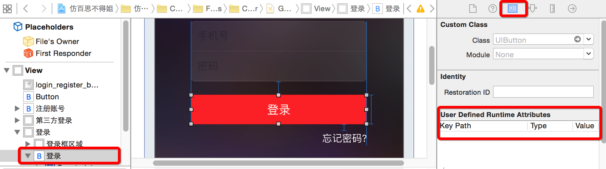

# object-c-projects

## 仿百思不得姐

### 7 发布界面

- 使用UIAppearance设置好navigationItem的属性之后，view没有加载之前设置enable=NO不生效
	
	主动调用layoutIfNeed使得之前的设置生效
	
	```objc
	[self.navigationController.navigationBar layoutIfNeeded];
	```

- 带占位文字的textView的实现
	
	- 使用label实现
	- 注意需要重写textView之前的属性设置方法，以确保占位label的正确性

### 6 其他补充
- UIMenuController
	
	UIMenuController使用：[简书资料](http://www.jianshu.com/p/ddd59867909a)
	
- 图片的圆角
	
	- 方法一：
		
		```objc
		imageView.layer.cornerRadius = 10;
		imageView.clickToBounds = YES;
		```
		
		缺陷：过多的图层进行圆角处理，会导致app比较卡，消耗性能比较大
	
	- 方法二
		
		将image进行圆角处理，然后显示到imageView上（quartz2D）
		
		iOS离屏渲染性能消耗 [简书资料](http://www.jianshu.com/p/6d24a4c29e18)

### 5 精华模块评论
- 主界面集成热门评论
	- 父控件的高度根据子控件的高度的变化而变化
	
	
- 评论界面
	- 头部视图
	使用上一个控制器中的cell当做这个界面的headerView
	
		
	
		tableview的headerView是一个比较特殊的view，系统对它会做比较多的后台处理，tableviewcell也是一个比较特殊的view，因此直接使用cell做headerView会出现一些莫名其妙的问题，这里使用UIView做一层包装
		
		```objc
		// 头部
	    UIView *header = [[UIView alloc] init];
	    
	    // cell的设定，当做普通的view使用
	    GWTopicCell *cell = [GWTopicCell cell];
	    cell.topic = self.topic;
	    cell.frame = CGRectMake(0, 0, GWScreenW, self.topic.cellHeight);
	    [header addSubview:cell];
	    
	    // view的设定
	    header.height = self.topic.cellHeight + GWTopicCellMargin;
	    
	    self.tableView.tableHeaderView = header;
		```
	- section的header
		
		一下2个方法控制section的header
		
		```objc
		// 只能控制头视图展示的内容，不能进行精细的控制
		- (NSString *)tableView:(UITableView *)tableView titleForHeaderInSection:(NSInteger)section
		// 精细控制， 可以返回UITableViewHeaderFooterView 类型的view，像cell一样进行重复利用
		- (UIView *)tableView:(UITableView *)tableView viewForHeaderInSection:(NSInteger)section
		```
	- iOS8之后cell的高度自动计算

		首先设置tableview的属性

		```objc
		// 预估的cell的高度
    	self.tableView.estimatedRowHeight = 44;
    	// 自动计算cell的高度
    	self.tableView.rowHeight = UITableViewAutomaticDimension;
    	
    	
		```
		然后，需要在xib中设置cell的bottom是根据最后一个空间的bottom来计算的
		
		
	
	- cell中集成音频的处理
		- 按钮
			xib中调整按钮内容的位置
			
			
		- cell的高度的计算
			之前cell的高度是按照label的高度来进行计算的，现在按钮的固定高度为22，因此给label添加一个属性即可实现自动计算cell的高度
			
			
			
	- 集成tableviewHeader与footer进行刷新的控制（page控制加载哪些数据，返回total控制footer状态）
		- Header进入刷新
			- 1、停用footer的刷新状态
			- 2、网络请求失败：停止header的刷新状态
			- 3、网络请求成功：请求返回数据处理，页码处理，停止header的刷新状态，进行footer的状态判断（没有更多、还有更多、没有一条数据无需显示footer）
			- 4、footer刷新还未完成，同时进入Header的刷新，需要将上一次的网络请求回调中止掉（或者说上一次的网络请求任务中止掉）
		- footer进入刷新，参照Header进行相同处理
		- 控制器dealloc时候：将网络任务中止掉，防止回调的时候出现内存访问错误
	
### 4 加号发布模块
- 实现方法（3种）
	- 控制器，modal出来
	- view添加到tabbarVc上
	- 新建一个window，并显示

- 动画思路分析
	需要做动画的界面，先搭建动画完成后最终的界面，然后在考虑动画怎样执行

- 弹簧动画的实现
	- UIView的方法：
	
		```objc
		// 示例
		[UIView animateWithDuration:0.2 delay:0 
			usingSpringWithDamping:0.5 initialSpringVelocity:0.44 
			options:UIViewAnimationOptionCurveLinear animations:^{
   		 	// 需要改变的因素
		 	} completion:nil];
		``` 

	- Facebook/pop框架：类似于CoreAnnimation
		
		```objc
		pop和Core Animation的区别
		1.Core Animation的动画只能添加到layer上
		2.pop的动画能添加到任何对象
		3.pop的底层并非基于Core Animation, 是基于CADisplayLink
		4.Core Animation的动画仅仅是表象, 并不会真正修改对象的frame\size等值
		5.pop的动画实时修改对象的属性, 真正地修改了对象的属性
		```
		
	- iOS9.0 提供了新的api: CASpringAnimation做layer的核心动画

	- UIDynamic框架
		- 可以认为是一种物理引擎，能模拟和仿真现实生活中的物理现象
		- 使用步骤
			- 创建一个物理仿真器（顺便设置仿真范围）
			- 创建相应的物理仿真行为（顺便添加物理仿真元素）
			- 将物理仿真行为添加到物理仿真器中  开始仿真
		

- UIWindow知识点
	- window创建完成之后默认是hidden=YES，只要设置为NO即可显示window
	- window有3中级别
		
		```objc
		UIWindowLevelNormal(普通级别，最低级别)
		UIWindowLevelStatusBar(和状态栏一样的级别，这个级别或者之上的window就可以遮盖状态栏)
		UIWindowLevelAlert(和alertview一样的级别，最高)
		```
	
### 3 精华模块
- 精华主界面
	- 小知识点:
		- 获取按钮内部文字的宽度

			按钮内部封装有一个titleLabel用于显示文字，只要先设置好文字、font等属性，在获取titleLabel的宽度即可得到文字的宽度，不过要显示出来才能得到准确的宽度，如果要立马获取，可以调用`[button.titleLabel sizeToFit]`要求系统立即更新获取准确的数值
			
		- 按钮的disable状态下的颜色也可以修改

		- scrollView的代理方法
		
			```objc
			// scrollview滑动动画停止(代码执行的动画或者人为拖动的动画)
			- (void)scrollViewDidEndScrollingAnimation:(UIScrollView *)scrollView
			// 人为推动产生的减速效果（代码动画无法监听）
			- (void)scrollViewDidEndDecelerating:(UIScrollView *)scrollView
			```
		- scrollView代码滑动方法的使用细节
			
			```objc
			// 如果使用下述方法想要产生效果，必须scrollview的contentSize中的width和height都有值
			// 一般我们可能在某个方向上没有滑动时设置为0
			- (void)scrollRectToVisible:(CGRect)rect animated:(BOOL)animated; 

			// 没有上述限制
			- (void)setContentOffset:(CGPoint)contentOffset animated:(BOOL)animated;
			```
			
		- UITableViewController中，tableview的frame被系统默认修改了，y = 20，height = 屏幕高度 - 20；（20为状态栏的高度）

	- 同时集成上拉刷新和下拉刷新控件注意点(参考GWWordViewController.m代码)
		- 页码的控制：
		  
		  应该在success的block中对页码进行相应的还原为0或者+1，不应该在发送请求之前就进行控制，一旦网络请求失败，就会出现无法控制的异常情况
		  
		- footer和header刷新状态的控制 + 网络请求数据处理的控制：

			在footer进入刷新发送请求的时候，需要停止header的刷新状态，同理header进入刷新发送请求的时候，停止footer的刷新状态，理由是网络请求总是以最后一次为准（如果不以最后一次为准的话，非常容易出现不可控的状况，举例： 当前加载到第五页的数据，网络比较慢，先下啦，然后上啦，可能上啦的数据先返回，然后本地数组被清空了，之后第五页的数据再返回，那么会直接加到后面，这样就有第0页和第5页的数据同时出现）， 忽略之前的请求的方式可以参考推荐关注界面的方式
			
	- 标题与vc重构
	  
	  标题不在自己定义一个数组，而是有vc的title记录，从self.childViewControllers中可以取出title，进而实现更换控制器的位置，上面的标签的位置也随之进行更改
	  
	- 子控制器的重构
	  
	  精华主页面添加的子控制器的代码基本一致，所以统一使用一个类进行重构， 唯一不同的只是加载数据的type不一致， 添加属性进行区分 
	  
	- 计算cell的高度

		cell的高度的计算可以在model中进行，并且存储，控制器只要获取就可以了，提高代码的可维护性
		
		- 计算text文本的高度
		
	- 各种类型的cell展示流程
		1、cell的主体界面搭建好，中间是各种图片、音频等的位置，先空出来
		2、根据返回的type确定cell的类型，计算cell的高度
	 	
	 	- text的cell 
	 		中间的高度为0，因此最简单
	 		
	 	- picture的cell
	 	
	 		- 自定义一个pictureView，为中间展示的内容
	 		- 在topic模型中计算pictureView的frame位置
	 		- cell中使用懒加载的方式加载pictureView，在setTopic：中判定cell的类型，当为picture的时候，给pictureView赋值frame
	 		- 注意：如果给pictureView的frame进行了赋值，并且打印frame是自己赋值的，但是显示出来的尺寸确不一样，有可能是view的autoresizingMask属性在作怪，需要设置为UIViewAutoresizingNone
	 		
	 		- 图片太长的处理：
	 			图片尺寸超出一定长度之后，需要变成小图，这时候需要设置imageView的contentMode，不然大图无法展示
	 			同时要设置imageView超出部分进行裁剪
	 			
	 		- 大图片的加载过程： 需要一个占位图片
	 			- 利用imageView的UIViewContentModeScaleAspectFit的模式，可以让图片完全，自动进行等比例拉伸
	 			- 背景图片在要显示的图片之前加入view中，等图片加载完成就会遮掉背景图片，同时图片的imageView的背景色需要设置为clearColor不然背景图标无法看见
	 			
	 		- 加载过程的进度条：使用第三方框架
	 			- 使用第三方框架有风险，降低风险有以下几种方式：
	 				- 继承（一般是View等控件）
	 				- 封装（AFN、SD等比较底层的框架）
	 		
	 		- 图片点击查看
	 			- modal出来一个新的控制器
				- 图片的位置的计算
				- 图片保存到相册（注意回调方法的定义）
			
			- 图片下载细节处理
				- 拖动cell，由于重用机制导致进度条与当前cell的下载进度不一致，需要在模型中记录进度值
				- 点击未下载完成的图片后，进去什么都没有，有2种处理方法，一种是未下载完成不允许点击进入，另一种方式是进去也显示一个下载进度

			- 大图显示细节处理：（只显示大图的top部分，而不是center部分）
				- 方法一：在原来imageView上面添加一个imageView1，imageView1的尺寸是计算出来要显示的的尺寸。举例：假设imageView的尺寸300*200， 下载图片的尺寸为600*1000， 经过等比例的拉伸计算为300*500， 那么imageView1的尺寸就是300*500， 添加到imageview上面，然后剪裁子视图，这样就只看到上面的部分。
				- 方法二：使用quartz2D绘制图片。 使用image drawRect：方法绘制到imageView中，但是传入的rect的size（就是上个例子中的300*500）需要计算，但是开启的上下文的尺寸是imageview的size，从（0，0）开始绘制，这样也只有上部分
				
		- audio的cell
			
			仿照picture类型的cell进行处理，只是不用再去处理超大的图片
		
		- video的cell
			
			同上处理
			
	- cell的重用导致的问题
		
		在全部模块，各种cell都有，因此在cell的内部需要进行处理，例如，picture的cell的时候，需要将其他的view隐藏。
	
### 2 我的关注模块
- 推荐关注界面

	- 小知识点:
		- xib 中对label的内容进行换行, 可以使用 option + 回车
		- 在有导航控制器的环境下,如果在viewController中的子控件中有scrollview及其子类的时候,需要注意系统可能默认会修改它的contentInsert, 可以在viewDidLoad中打印看看, 如果不需要系统进行修改,可以修改VC的属性:
		
			```objc
			self.automaticallyAdjustsScrollViewInsets = NO;
			```
			
		- tableviewcell在选中时会调用方法`- (void)setSelected:(BOOL)selected animated:(BOOL)animated`
		
		-  默认tableviewcell在选中时其内部的子控件进入heighlight的状态,但是如果cell的selectionStyle为none的时候,子控件在选中的时候不会进入heighlight状态  
	- 遇到的问题:
		- 重复请求
		
			左侧选择不同类别,总是请求服务器数据, 应该已经加载过的在内存中做一份保存,而不是每次都加载
			
			解决方式: 在类别的模型中增加一个users属性,这样每个类别就有对应的推荐用户, 方便管理(利用模型解决数据的存储问题,而不是直接在控制器中管理, 代码更清晰,更容易维护)
			
		- 上拉下拉刷新控件状态控制逻辑

			上拉下拉刷新请求数据完成后, success的话都会调用tableview的reloadData去刷新表格,因此可以在其数据源方法`- (NSInteger)tableView:(UITableView *)tableView numberOfRowsInSection:(NSInteger)section`中实时监测刷新控件的状态, failure的话则在相应的failure回调中处理
			
		- 不停的切换左边类别时候, 多次请求的处理
		
			其实, 我们需要在发送请求的函数中记录最后的请求时候的一些状态(如:请求参数或者做一些自定义的标记), 然后在block回调中进行处理
			原理是: block中对局部变量会做一次retain操作(不加__block修饰符情况下, 局部变量在block内部是不会改变的), 而self是控制器本身, self记录的状态是会随着函数的调用多次改变的
			注意: vc的dealloc中需要cancel掉请求, 不然会造成请求返回时回调的代码中的self被释放掉导致崩溃
			
- 推荐标签页面
	
	- setFrame:方法的妙用
	
	```objc
	- (void)setFrame:(CGRect)frame
{
	    // 让cell左边有间距
	    frame.origin.x = 5;
	    frame.size.width -= 2 * frame.origin.x;
	    
	    // 让cell的高度减少，留出2个cell之间的空隙，相当于有分割线
	    frame.size.height -= 1;
	    
	    [super setFrame:frame];
}
	```
	
	setFrame:方法还可以用于自定义控件的时候，防止自己的尺寸被外部修改
	
	``` objc
	// 方法重写
	- (void)setFrame:(CGRect)frame
{
		// view的size固定
	    frame.size = CGSizeMake(100, 100);
	    [super setFrame:frame];
}
// 方法重写
- (void)setBounds:(CGRect)bounds
{
	    bounds.size = CGSizeMake(100, 100);
	    [super setBounds:bounds];
}
	```

- 登录注册页面
	- 小知识点
		- 从xcode5.x开始(具体版本不清楚), imageAssets中的图片可以设置拉伸的保护区域, 而不必非得使用代码了

		imageAssets中选中图片 -> 右下角 show slicing
		
		
		
		添加拉伸保护之后
		
		
		
		- xib文件中, 设置view的一些属性可以使用KVC来设定, 例如图层的圆角等

		
		
	- 修改textField的占位文字的属性
		- 方法1: 使用属性

		```objc
		@property(nonatomic,copy)   NSAttributedString     *attributedPlaceholder;
		
		// 文字属性
		NSMutableDictionary *attrs = [NSMutableDictionary dictionary];
		attrs[NSForegroundColorAttributeName] = [UIColor grayColor];
		
		// NSAttributedString : 带有属性的文字(富文本技术)
		NSAttributedString *placeholder = [[NSAttributedString alloc] initWithString:@"手机号" attributes:attrs];
		self.phoneField.attributedPlaceholder = placeholder;
		
		NSMutableAttributedString *placehoder = [[NSMutableAttributedString alloc] initWithString:@"手机号"];
		[placehoder setAttributes:@{NSForegroundColorAttributeName : [UIColor whiteColor]} range:NSMakeRange(0, 1)];
		[placehoder setAttributes:@{
		                            NSForegroundColorAttributeName : [UIColor yellowColor],
		                            NSFontAttributeName : [UIFont systemFontOfSize:30]
		                            } range:NSMakeRange(1, 1)];
		[placehoder setAttributes:@{NSForegroundColorAttributeName : [UIColor redColor]} range:NSMakeRange(2, 1)];
		self.phoneField.attributedPlaceholder = placehoder;
		```
		- 方法2: 继承并重写方法

		```objc
		- (void)drawPlaceholderInRect:(CGRect)rect
		{
			// rect的尺寸需要自己计算
		    [self.placeholder drawInRect:CGRectMake(0, 10, rect.size.width, 25) withAttributes:@{
		                                                       NSForegroundColorAttributeName : [UIColor grayColor],
		                                                       NSFontAttributeName : self.font}];
		}
		```

		- 方法3: 使用runtime查找textField内部的隐藏属性,并使用KVC进行设定
		
		```objc
		[self setValue:[UIColor grayColor] forKeyPath:@"_placeholderLabel.textColor"];
		```
	
		补充: runtime使用(简单使用: 查找成员属性)
		
		```objc
		unsigned int count = 0;
		
		// 拷贝出所有的成员变量列表
		Ivar *ivars = class_copyIvarList([UITextField class], &count);
		
		for (int i = 0; i<count; i++) {
		    // 取出成员变量
		    // Ivar ivar = *(ivars + i);
		    Ivar ivar = ivars[i];
		
		    // 打印成员变量名字
		    XMGLog(@"%s", ivar_getName(ivar));
		}
		
		// 释放
		free(ivars);
		```
		
### 1 基本界面骨架搭建
- 新建项目，并初始化启动图片、appIcon等

- 主框架界面搭建（自定义tabbarcontroller）
	- 子控制器的tabBarItem的设定
		- 图片（默认图片会被渲染成系统的颜色，需要手动设定）
		
		第一种方式，代码设定
		
		```objc
		UIImage *selectImage = [UIImage imageNamed:@"tabBar_essence_click_icon"];
    selectImage = [selectImage imageWithRenderingMode:UIImageRenderingModeAlwaysOriginal];
    vc.tabBarItem.selectedImage = selectImage;
		
		```
		第二种方式，在imageAsset中对图片进行属性设定
		
		```
		Render As 设定为 Original Image
		```
		
		- 文字属性设定(单一设定)
		
		```objc
		// 普通状态
    NSMutableDictionary *attr = [NSMutableDictionary dictionary];
    attr[NSFontAttributeName] = [UIFont systemFontOfSize:12];
    attr[NSForegroundColorAttributeName] = [UIColor grayColor];
    [vc1.tabBarItem setTitleTextAttributes:attr forState:UIControlStateNormal];
    // 选中状态
    NSMutableDictionary *selectAttr = [NSMutableDictionary dictionary];
    selectAttr[NSFontAttributeName] = [UIFont systemFontOfSize:12];
    selectAttr[NSForegroundColorAttributeName] = [UIColor darkGrayColor];
    [vc1.tabBarItem setTitleTextAttributes:selectAttr forState:UIControlStateSelected];
    vc1.tabBarItem.title = @"精华";
		```
		
		- 文字属性设定（appearance对象设定）
		
		使用appearance对象设定，是一次性的设定，之后所有UITabBarItem对象都拥有相同的属性，哪些属性能够设定的前提条件是，在头文件中能够找到`UI_APPEARANCE_SELECTOR`宏，其他可以以此类推
		
		```objc
		// 示例
		- (void)setTitleTextAttributes:(nullable NSDictionary<NSString *,id> *)attributes forState:(UIControlState)state NS_AVAILABLE_IOS(5_0) UI_APPEARANCE_SELECTOR;
		```
		
		appearance设定
		
		```objc
		// 获取当前对象的appearance
		UITabBarItem *item = [UITabBarItem appearance];
		// 设定普通状态
    NSMutableDictionary *attr = [NSMutableDictionary dictionary];
    attr[NSFontAttributeName] = [UIFont systemFontOfSize:12];
    attr[NSForegroundColorAttributeName] = [UIColor grayColor];
    [item setTitleTextAttributes:attr forState:UIControlStateNormal];
    // 设定选中状态
    NSMutableDictionary *selectAttr = [NSMutableDictionary dictionary];
    selectAttr[NSFontAttributeName] = [UIFont systemFontOfSize:12];
    selectAttr[NSForegroundColorAttributeName] = [UIColor darkGrayColor];
    [item setTitleTextAttributes:selectAttr forState:UIControlStateSelected];
		```
		
	- 重构之方法抽取
	
	  每个子控制器的创建代码都差不多,因此我们需要抽取一个公共方法,方法的设定有以下2种可供选择
	
	  ```objc
		// 方法一
		- (void)setupChildVcWithClass:(Class)childVcClass title:(NSString *)title image:(NSString *)image selectImage:(NSString *)selectImage
	{
	    UIViewController *childVc = [[childVcClass alloc] init];
	    childVc.view.backgroundColor = [self randomColor];
	    childVc.tabBarItem.title = title;
	    childVc.tabBarItem.image = [UIImage imageNamed:image];
	    childVc.tabBarItem.selectedImage = [UIImage imageNamed:selectImage];
	    
	    [self addChildViewController:childVc];
	}
		// 方法二
		- (void)setupChildVc:(UIViewController *)childVc title:(NSString *)title image:(NSString *)image selectImage:(NSString *)selectImage
	{
	    childVc.view.backgroundColor = [self randomColor];
	    childVc.tabBarItem.title = title;
	    childVc.tabBarItem.image = [UIImage imageNamed:image];
	    childVc.tabBarItem.selectedImage = [UIImage imageNamed:selectImage];
	    
	    [self addChildViewController:childVc];
	}
	  ```
	
		对比2个方法, 方法一种提供viewController的类型,使用alloc init创建子控制器,在当前的环境下有一定的局限性,因为外部子控制器的创建方式多样,进行限定的话,那么外面子控制器只能通过重写init方法进行个性化定制(如tableviewController的样式等),因此,可以由外面创建好了再传入进行公共的设定,所以选择方法二

- 自定义TabBar
	- 更换tabBarController的tabBar

		```objc
		// readonly无法通过set方法设定,只能使用kvc
	// self.tabBar = [[GWTabBar alloc] init];
	    [self setValue:[[GWTabBar alloc] init] forKeyPath:@"tabBar"];
		```
		
	- 自定义tabBar(继承自UITabBar)
		- 重写`- (instancetype)initWithFrame:(CGRect)frame`以便添加其他的子控件
		
		- 重写`- (void)layoutSubviews`进行子控件的布局
			
			注意: tabBar中使用根据tabbarItem生产的系统控件的类型是UITabBarButton(可以使用View调试器查看,也可以NSLog调试)
			
			```objc
			- (void)layoutSubViews
			{
				[super layoutSubviews];
				
				// 发布按钮的尺寸(或者自己添加的其他子控件的布局)
			    self.publishButton.bounds = CGRectMake(0, 0, self.publishButton.currentBackgroundImage.size.width, self.publishButton.currentBackgroundImage.size.height);
			    self.publishButton.center = CGPointMake(self.frame.size.width * 0.5, self.frame.size.height*0.5);
			    
			    // 其他UITabBarButton的尺寸(系统生成的子控件的布局)
			    CGFloat buttonY = 0;
			    CGFloat buttonW = self.frame.size.width / 5;
			    CGFloat buttonH = self.frame.size.height;
			    NSInteger index = 0;
			    for (UIView *button in self.subviews) {
			        if (![button isKindOfClass:NSClassFromString(@"UITabBarButton")]) continue;
			        
			        CGFloat buttonX = buttonW * (index > 1 ? (index + 1) : index);
			        button.frame = CGRectMake(buttonX, buttonY, buttonW, buttonH);
			        
			        index ++;
			    }
			}
			```
	

- 项目pch文件集成
	- targets -> build settings -> 搜索prefix header -> 设定pch文件的路径(在当前项目的总目录下的相对路径,不是整个文件的绝对路径)
	
	- 对于一些常用的宏和分类,可以在pch文件中导入
	

- navigationItem的设定
	- title的不同设定
	
		给viewController设定title相当于同时给当前控制器的tabbarItem和navigationItem设定了title, 如果要2个地方的title不同,得分开设定
		
		```objc
		self.navigationItem.title = @"我的关注";
    	self.tabBarItem.title = @"我的";
    
    	// 相当于同时设定以上两项
    	// self.title = @"我的";
		```
		
	- navigationBar上的model之间的层级关系
		
		- UINavigationController -> viewControllers -> 子控制器的堆栈
		- UINavigationbar -> items -> 子控制器对应的UINavigationItem的堆栈 -> 每个navigationItem 有leftBarButtonItems, rightBarButtonItems, backBarButtonItem(对应的model是UIBarButtonItem)
		- 如果要想当前控制器所在的navigationItem添加控件,应该添加UIBarButtonItem (titleView除外)
	
	- UIBarButtonItem创建代码的封装

		2种方式: 分类; 继承
		
		分析:
		 - 对原有类的方法进行扩展,可以使用分类
		 - 对原有类的方法进行重写,可以使用继承
		
		当前的需求是原来所有的类的方法不够使用,需要多增加一个方法来快速创建UIBarButtonItem, 以减少重复的代码, 考虑使用分类
		
- 设置全局的navigationItem的返回样式

	需求: 如果导航控制器push进去了一个控制器, 其左上角的返回样式要统一
	
	解决方式:
	  - 第一种: 每个控制器的viewDidLoad进行设置(太繁琐)
	  - 第二种: 导航控制器对子控制器的管理通过以下2个方法进行(navigationController的API中还提供了其他的方法供我们使用,但他们的底层都会调用以下方法)
	     - 进栈
	     `- (void)pushViewController:(UIViewController *)viewController animated:(BOOL)animated;`
	     - 出栈
	     `- (nullable UIViewController *)popViewControllerAnimated:(BOOL)animated;`
	     
	    因此,我们可以拦截push方法,在有新的控制器压入导航控制器的栈中的时候来对其返回按钮进行统一的设定, 实现这个思路就需要我们自定义导航控制器,重写其push方法进行拦截
	
	参考代码:
	
	```objc
	- (void)pushViewController:(UIViewController *)viewController animated:(BOOL)animated
	{
	    // 根控制器的左边返回按钮不用设定
	    if (self.viewControllers.count > 0) {
	        UIButton *backButton = [UIButton buttonWithType:UIButtonTypeCustom];
	        // 设置图片
	        [backButton setImage:[UIImage imageNamed:@"navigationButtonReturn"] forState:UIControlStateNormal];
	        [backButton setImage:[UIImage imageNamed:@"navigationButtonReturnClick"] forState:UIControlStateHighlighted];
	        // 设置文字
	        [backButton setTitle:@"返回" forState:UIControlStateNormal];
	        [backButton setTitleColor:[UIColor blackColor] forState:UIControlStateNormal];
	        [backButton setTitleColor:[UIColor redColor] forState:UIControlStateHighlighted];
	        // 点击事件
	        [backButton addTarget:self action:@selector(back) forControlEvents:UIControlEventTouchUpInside];
	        // 尺寸设置(随意设置的,如果要完全紧贴,可以使用sizeToFit方法)
	        backButton.size = CGSizeMake(70, 30);
	        // 整体内容左对齐
	        backButton.contentHorizontalAlignment = UIControlContentHorizontalAlignmentLeft;
	        // 由于系统布局,左边看起来还是有很多间隙,可以用contentEdgeInsets左移
	        backButton.contentEdgeInsets = UIEdgeInsetsMake(0, -10, 0, 0);
	        
	        viewController.navigationItem.leftBarButtonItem = [[UIBarButtonItem alloc] initWithCustomView:backButton];
	        
	        // 隐藏tabbar
        	viewController.hidesBottomBarWhenPushed = YES;
	    }
	    
	    // 将super的代码放在后面,是为了如果viewController有自己的独特的返回按钮样式的时候,不会被覆盖掉
	    [super pushViewController:viewController animated:animated];
	}
	```